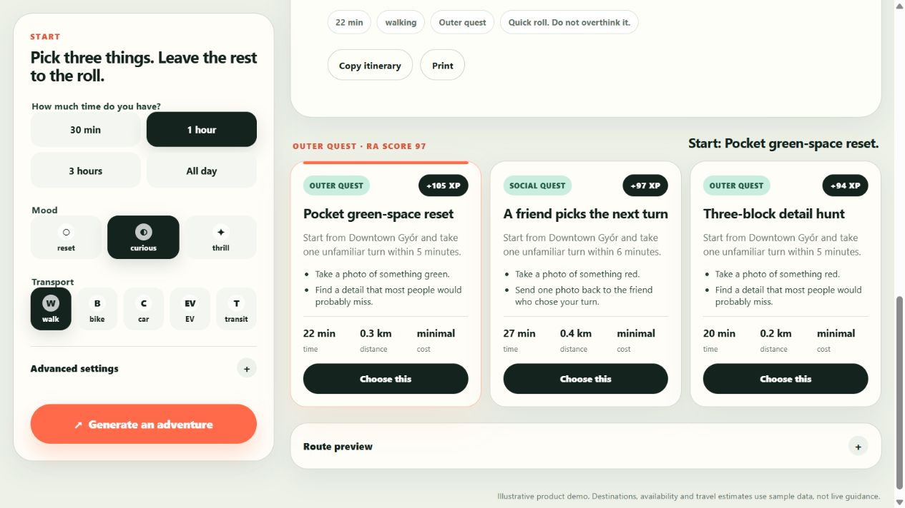

# Random Adventure — public MVP

Random Adventure is an anti-boredom quest generator that turns a few simple choices into an immediate, playable micro-adventure.

This repository contains a static, English-language product demo. It has no build step, account system, external API, analytics, or persistent user data.



## Try it locally

From this folder, run:

```sh
python -m http.server 4173
```

Then open <http://127.0.0.1:4173>.

You can also publish the folder directly with GitHub Pages.

## What the MVP demonstrates

- Three quick inputs: available time, mood, and transport.
- Optional controls for starting area, budget, priorities, and adventure mode.
- A transparent sample scoring model that ranks three possible quests without exposing an internal score in the interface.
- Quest Master narration, a clearly optional extra twist, sharing text, and a route-at-a-glance timeline.
- A labelled contextual affiliate placement that appears only after the adventure is chosen and never changes the ranking.
- Short local quests that genuinely fit a 30-minute time budget.
- Walking, cycling, car, EV, and public-transit modes.

## Repository structure

- `index.html` — accessible interface and controls.
- `src/styles.css` — responsive layout and visual design.
- `src/app.js` — scoring, mission generation, interactions, and route rendering.
- `data/places.js` — fictional sample destinations and activities.

## Demo-data boundary

All destinations, distances, availability cues, travel estimates, and scoring outcomes are illustrative sample data. They are not live travel, booking, charging, safety, or accessibility guidance.

The partner suggestion is also an illustrative placement. The public demo contains no affiliate link, booking feed, commission tracking, or partner integration.

The current rules are intentionally lightweight and deterministic so the product experience can be tested without exposing a production recommendation system or requiring an AI service.

## Privacy

The demo runs entirely in the browser. It sends no personal data anywhere and stores no profile or history.

## License

No open-source license is included. The code is published as a product demonstration; no reuse permission is granted by this repository.
